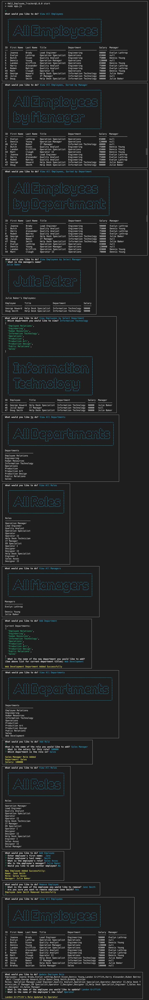

# Employee Tracker

## Table of Contents

- [Description](#program-description)
- [Repo Location](#repo-location)
- [Installation](#installation-instructions)
- [Usage](#usage-information) 
- [License](#licenses) 
- [Contributing](#contributing)
- [Tests](#tests)
- [DEMO VIDEO](#DEMO-click-link-to-view)
- [Screenshots](#screenshots)
- [Questions](#questions)

## Program Description
Employee Tracker is a CMS interface that makes it easy for non-developers to view and interact with information stored in a databases. This CLI is a solution for managing a company's employees, roles and departments. It is built with node, inquirer, and MySQL.

## Repo Location
#### The repo is located here: 
* [link to repo - https://github.com/brandyquinlan/Employee_Tracker](https://github.com/brandyquinlan/Employee_Tracker)

## Installation Instructions
  Run the command "npm i" to install dependencies

### Usage information
  To use the application, run the command "node app.js"

### Licenses
  none

### Contributing
  none

## Tests
 
## DEMO
* [Link to demo - https://drive.google.com/file/d/13R-5D1GZMi7H4Mf2s9DusZm1GOJXBscJ/view?usp=sharing](https://drive.google.com/file/d/13R-5D1GZMi7H4Mf2s9DusZm1GOJXBscJ/view?usp=sharing)

## Screenshots


### User Story
```
As a business owner
I want to be able to view and manage the departments, roles, and employees in my company
So that I can organize and plan my business
```
### Funtionality
```
The following options are available for managing the Employee Tracker CMS:
    'View All Employees',
    'View All Employees, Sorted by Manager',
    'View All Employees, Sorted by Department',
    'View Employees by Select Manager',
    'View Employees by Select Department',
    'View All Departments',
    'View All Roles',
    'View All Managers',
    'Add Department',
    'Add Role',
    'Add Employee',
    'Remove Employee',
    'Update Employee Role',
    'Exit'
```
The following npm modules were used:
```
mysql
inquirer
asciiart-logo
console.table
chalk
```

## Questions
Please contact me with questions:
```
Brandy Quinlan
Email: brandyquinlan@gmail.com
Github link: brandyquinlan
```

